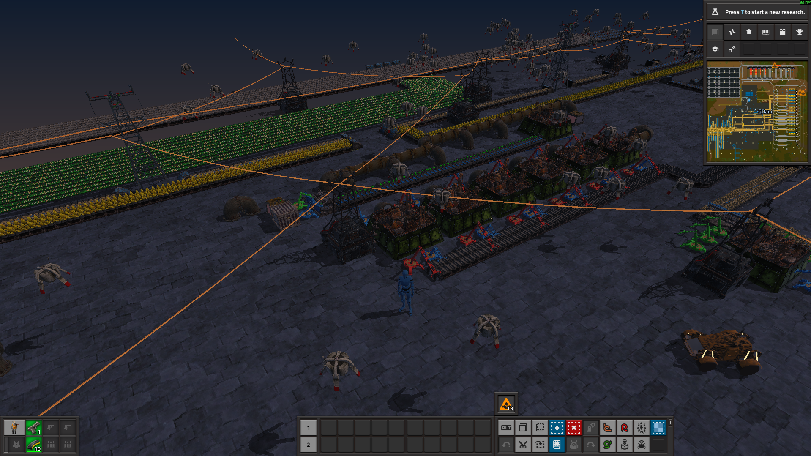
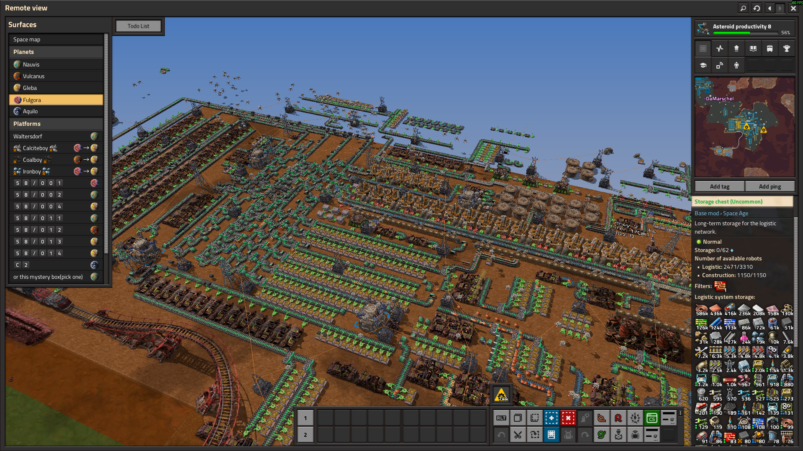

# factorio_3d_models

A 3D mod for Factorio.




## Install

1. Grab the latest zip from the [Releases](../../releases) tab.
2. Unzip it anywhere.
3. Start Factorio and load a save.
4. Run `injector.exe`.

A console window appears inside the game and the models fade in as they load.
Keep the folder together — the injector expects the DLL and `models/` next to
it.

## Controls

| | |
|---|---|
| **Shift + right-drag** (or **middle-drag**) | rotate / tilt the camera |
| **Shift + scroll** | 3D zoom out and back in |
| **Shift + scroll in** (at closest zoom) | enter first person — the mouse steers, **Ctrl** or **Esc** frees the cursor, **scroll out** exits |
| **AltGr** (right Alt) | reset to the vanilla top-down view |

Menus, GUIs and mouse picking work as usual.

## Build from source

Needs the Rust toolchain and Factorio's `factorio.pdb` (it ships with the
Windows build — the hooks are found by symbol name, so most survive a game
update).

```
cargo build --release
# start factorio, load a save, then:
cargo run --release -p injector
```

Log: `%APPDATA%\Factorio\factorio_3d_models.log`.

## Tuning

`f3dm_tuning.txt` is written next to the DLL on first run and re-read once a
second, so yaw, lift and lighting can be dialled in live — no rebuild. It also
takes per-model overrides, matched by substring against the model path:

```
yaw:oil-refinery=180        # extra yaw, degrees
off:oil-refinery=0.5,-0.5,0 # nudge: dx east, dy south, dz up (tiles)
night=0.5                   # day/night doesn't sync yet — set it by eye
```

## After a game update

Hooks resolve by PDB symbol name and should keep working. If one doesn't, the
fallback RVAs in `factorio_3d_models/src/offsets.rs` need a refresh:

```
cd tools/pdb-explorer
cargo run --release -- "<path>\factorio.pdb" "<search>" --max 10
```
